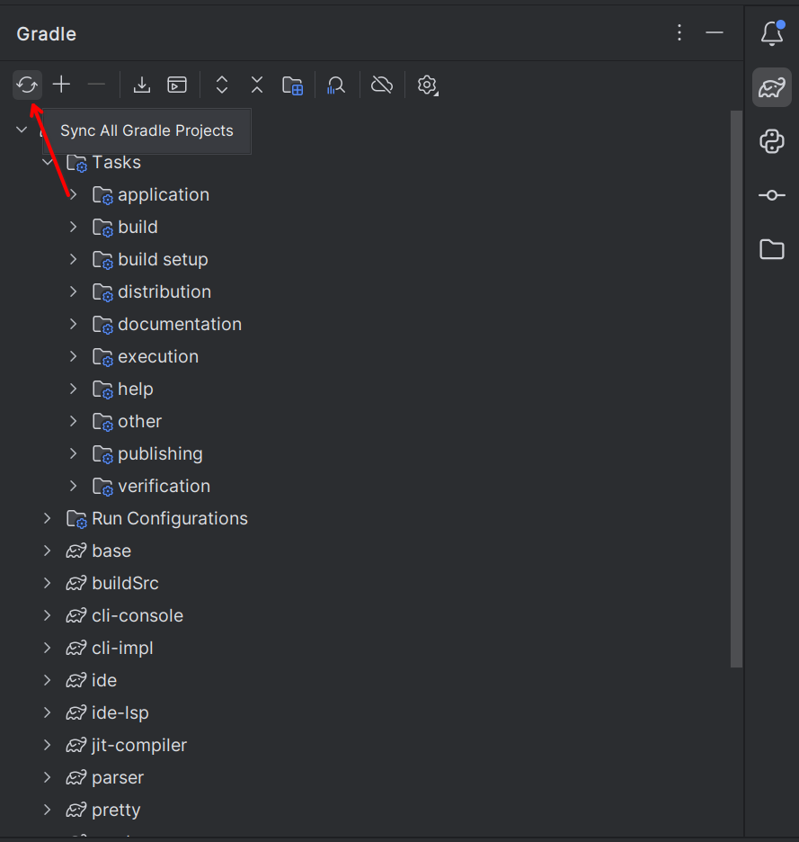
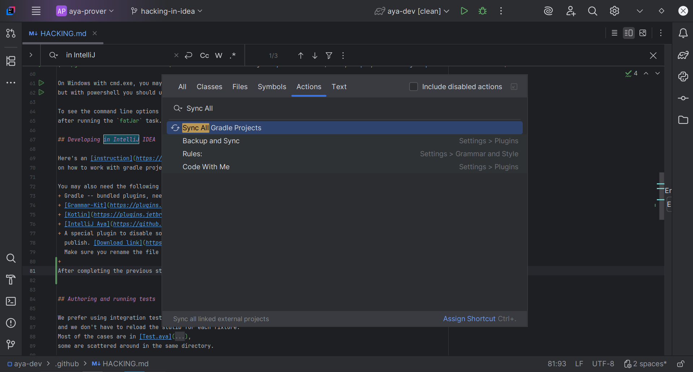

# Hacking Aya

[Java 25]: https://jdk.java.net/25

> [!IMPORTANT]
>
> Since you need [Java 25] to set this project up, in case your choice
> of IDE is IntelliJ IDEA, version 2024.2 or higher is required.

We use gradle to build the compiler. It comes with a wrapper script (`gradlew` or `gradlew.bat` in the root of the
repository) which downloads appropriate version of gradle automatically if you have JDK installed.

The rest of the guide is split into two main parts: working with the project, which is mainly about the software
engineering aspects of the project, and understanding the code, which is about the design and implementation of the
type checker.

# Working with the project

## Subprojects

Aya is divided into several subprojects. Here are some notable ones:

### Aya-specific subprojects

+ The syntax definitions live in `syntax`. This includes both the core and the concrete syntax.
+ The parser is separated into `parser` (the generated parsing code) and `producer`
  (transformer from parse tree to concrete syntax tree).
+ The type checker and all the related utilities live in `base`.
+ The JIT compiler and code generation utilities live in `jit-compiler`.
+ The generic pretty printing framework is in `pretty`. It is similar to the Haskell `Doc` framework.
+ The library system, literate mode, single-file type checker, and basic REPL implementation are in `cli-impl`.

### General, reusable utilities

+ A bunch of other utilities including files, ordering, persistent union find, etc.
  are in `tools`.
+ The source-pos related utilities, generalized binary operator parser,
  generalized mutable graph, generalized termination checker,
  and some generic coverage checking tools, are in `tools-kala` because they depend
  on a larger subset of the kala library (the primitive collections).
+ The command and argument parsing framework is in `tools-repl`.
  It offers an implementation of jline3 parser based on Grammar-Kit and relevant facilities.
+ The literate-markdown related infrastructure is in `tools-md`.
  It offers [JetBrains/markdown] extensions for literate mode of any language with a highlighter.

[JetBrains/markdown]: https://github.com/JetBrains/markdown

## Common Gradle Tasks

All gradle tasks are case-insensitive.
You may also use the camelCase shorthand if there is no ambiguity, for example `fatJar` can be `fJ`,
`testCodeCoverageReport` can be `tCCR`, etc.

| Command                         | Description                                                                                          |
|:--------------------------------|:-----------------------------------------------------------------------------------------------------|
| `./gradlew :cli-console:fatJar` | build a jar file which includes all the dependencies which can be found at `cli-console/build/libs`. |
| `./gradlew install`             | build the jlink image to the directory specified by `installDir` in `gradle.properties`.             |
| `./gradlew test`                | run all tests.                                                                                       |
| `./gradlew showCCR`             | run all tests with coverage and, if on Windows/Linux, display the coverage report.                   |

On Windows with cmd.exe, you may replace `./gradlew` with `gradlew` or `.\gradlew`,
but with powershell you should use `./gradlew`.

To see the command line options of the application, run `java -jar [file name].jar --help`
after running the `fatJar` task.

## Developing in IntelliJ IDEA

Here's an [instruction](https://www.jetbrains.com/help/idea/gradle.html)
on how to work with gradle projects in IntelliJ IDEA.

You may also need the following plugins:
+ Gradle -- bundled plugins, needed for building the project
+ [Grammar-Kit](https://plugins.jetbrains.com/plugin/6606) for editing the parser
+ [Kotlin](https://plugins.jetbrains.com/plugin/6954) for editing the build scripts
+ [IntelliJ Aya](https://github.com/aya-prover/intellij-aya) (unpublished yet) for editing Aya code
+ A special plugin to disable some incorrect error report of JPMS in IntelliJ IDEA, which we would not like to
  publish. [Download link](https://github.com/user-attachments/files/18740788/fuck.idea.jpms-SNAPSHOT.jar.zip).
  Make sure you rename the file to remove the `.zip` postfix so it becomes a jar

After importing the project, the code analysis in the Aya source code should be available.
However, there might be some errors in the build files (with extension `.gradle.kts`), which shouldn't affect
hacking Aya, but can be annoying sometimes. You can manually refresh the symbols by running the
`Sync All Gradle Projects` in the Gradle tool window or search its name to fix this.

<details>
<summary>IDE Screenshots</summary>




</details>

For Nix users, run `nix develop` to enter a development shell with JDK and Gradle,
or use [direnv](direnv) to automatically activate/deactivate shell in 
And run `nix build .#aya` to build aya-prover from source.

You may use our binary cache on [Cachix](Cachix) to save time from compilation:

```sh
# Permanently add to $XDG_CONFIG_HOME/nix/nix.conf
nix run nixpkgs#cachix -- use aya-prover
# Temporary usage
nix <subcommand> \
  --option extra-substituters "https://aya-prover.cachix.org" \
  --option extra-trusted-public-keys "aya-prover.cachix.org-1:BNuUD9aNZMDmYISC77aqZfzP4l9XtTHQvYwPhKO+Msg="
```

> [NOTE for developers]
> After modifying dependency versions in Gradle,
> please run `.github/workflows/check-nix-gradle-lock.sh`
> and commit changes in `nix/deps.json` in order to
> synchronize Nix lock for Gradle dependencies.

[Cachix](https://app.cachix.org/)

## Authoring and running tests

We prefer using integration tests, which is very convenient -- all fixtures can use the stdlib,
and we don't have to reload the stdlib for each fixture.
Most of the cases are in [Test.aya](../cli-impl/src/test/resources/success/src/Test.aya),
some are scattered around in the same directory.

The runner for integration test is [LibraryTest](../cli-impl/src/test/java/org/aya/test/LibraryTest.java).
There's a `main` function, with a few more test cases you can run with either gradle or intellij.

The golden test fixtures for error reporting can be found in the
[negative](../cli-impl/src/test/java/org/aya/test/fixtures) directory,
and the runner is [TestRunner](../cli-impl/src/test/java/org/aya/test/TestRunner.java).

# Understanding the code

To understand the Aya source code, it is very important to conceptually comprehend the type theoretic techniques
used in the language. This section explains these concepts.

This section assumes basic familiarity with type checkers for dependent type theory,
such as the notion of a core language, syntax with bindings, de Bruijn indices, telescopes, etc.,
and the need of a "partial evaluator" for normalizing terms.

## Pre-elaboration passes

After parsing using the Grammar-Kit parser,
the [AyaProducer](../producer/src/main/java/org/aya/producer/AyaProducer.java) translates the parse tree into the
surface syntax tree. Then we will run [StmtResolver](../base/src/main/java/org/aya/resolve/visitor/StmtResolver.java)
on the top-level statements, to get the variable references resolved using the library system.

Then, based on the resolved references, we desugar the code using [Desalt](../base/src/main/java/org/aya/resolve/salt/Desalt.java),
whose main job is to turn `BinOpSeq` -- a sequence of binary operator items -- into the appropriate tree structure.

Then we turn the definitions into a graph of dependencies based on the "referencing" relation,
and infer the type checking order based on it. We type check each strongly connected component (SCC) in topological order.
In case an SCC fails, we will try to type check the other SCCs that don't depend on it.

## Binding and substitution

Aya uses both locally nameless and HOAS (higher-order abstract syntax) for binding and substitution.
The generic interface for "substitutable stuff" is [Closure](../syntax/src/main/java/org/aya/syntax/core/Closure.java).
During type checking, Aya produces locally nameless terms, and they will be _compiled_ down to HOAS after elaboration.

The interface for core language is [Term](../syntax/src/main/java/org/aya/syntax/core/term/Term.java), which has
sufficiently readable markdown-based javadoc. One may navigate through the code by clicking the links using an IDE.

For a more detailed explanation, see the [related blog post](https://www.aya-prover.org/blog/jit-compile).

## Identity and quotients

Aya integrates XTT, a set-level cubical type theory, for a well-behaved identity type
(the cubical path type), together with the cubical syntax for higher-inductive types.

The set-level truncation turns the higher-inductive types into quotients.

## Pattern matching

Aya has pattern matching in its kernel for reduction of overlapping and order-independent patterns,
even though the first-match functions do not need the clauses.
This might be further improved in the future.

The patterns will be _compiled_ to a state machine for pattern matching during the HOAS code generation,
so we no longer need to traverse the patterns when unfolding functions.

Inspired from Agda, Aya does not unfold a function to its clauses when the function call is stuck.
This differs from Coq/Lean, where pattern matching is more "first-class", so stuck pattern matchings can be
accidentally pretty printed, which can make error messages much harder to understand.

## Termination checking

Aya implemented a termination checker using call matrices with predicative assumption, very similar to Agda.
This makes it very difficult to support an impredicative universe, see [Agda #3883](https://github.com/agda/agda/issues/3883).

## Generalization

The implementation is going to be fixed soon, I promise

## Definitional proof irrelevance

This is too hard. We haven't done anything about it yet. Tried a few times, never got satisfactory results.

# More information

There is the [note](../note) directory, which contains some development notes about naming conventions,
specification of certain subroutines, literature review of certain features of existing proof assistants,
things to keep in mind when working on parts of the project, etc.
Unfortunately, most of them are in Chinese, but you can ask a Chinese-speaking developer for translation.
